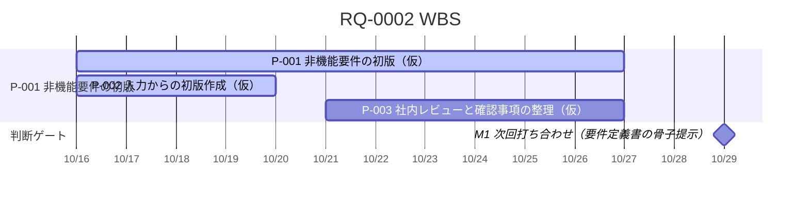

# RQ-0002 WBS

> 【ダミー】Flow動作確認テスト用の架空案件。会社・人物・数値はすべて架空。

依頼の終了までに必要な作業を、長い時間軸で見渡すための地図。1行は作業パッケージ（成果物が1つ決まる単位）で、複数のWorkを束ねてよい。直近の順番・担当の細部は進行計画、TODO・実績はWorkの作業メモに書く。

更新するのは、作業パッケージの追加・削除、成果物・完了条件・時期の見直し、状態の変化、Workの紐づけのとき。日々の進捗では更新しない。作業パッケージの追加・削除と成果物・完了条件・時期の変更はPlan承認の対象とする。

## 到達点

非機能要件の初版が、章ごとに確認済み・未確認・対象外で整理され、未確認と矛盾が確認事項として残っていること。社内でレビューできる状態を終了条件とする（RQ-0002 期待する結果・終了条件、CTX-0015）。

## 作業パッケージ

| 計画項目ID | 親項目ID | 作業パッケージ | 成果物 | 完了条件 | 開始予定 | 終了予定 | 先行 | 日付の確度 | 状態 | 紐づくWork |
| --- | --- | --- | --- | --- | --- | --- | --- | --- | --- | --- |
| P-001 | なし | 非機能要件の初版 | P-002・P-003の成果 | P-002・P-003が完了している | 2026-10-16 | 2026-10-27 | なし | 仮 | 進行中 | なし |
| P-002 | P-001 | 入力からの初版作成 | 非機能要件.md、システム構成図.excalidraw、構成データ.json | MAT-0002・0003を根拠に章ごとの状態と確認事項が整理されている | 2026-10-16 | 2026-10-20 | なし | 仮 | 進行中 | W-0002 |
| P-003 | P-001 | 社内レビューと確認事項の整理 | レビュー結果、顧客へ聞く確認事項の一覧 | 初版のレビューが済み、確認事項に質問・確認先・影響がある | 2026-10-21 | 2026-10-27 | P-002 | 仮 | 未着手 | なし |

- 日付は根拠のない仮置き。次回打ち合わせ（2026-10-29）の前に社内レビューが終わるよう逆算した。

## マイルストーン・判断ゲート

| 節目 | 予定日 | 日付の確度 | 到達条件・判断事項 | 判断者 | 関連する計画項目ID |
| --- | --- | --- | --- | --- | --- |
| M1 次回打ち合わせ（要件定義書の骨子提示） | 2026-10-29 | 確定 | 非機能の確認事項を顧客へ聞ける状態になっている | 当社 佐々木（見込み） | P-003 |

## ガントチャート

次の区間は検査ツールが作業パッケージ表とマイルストーン表から生成する。手で編集せず、表を直してから `project_workflow_check.py gantt --root . --wbs <このファイル> --write` で更新する。

<!-- gantt:start -->

<!-- gantt:end -->

## 改訂履歴

| 改訂 | 日付 | 変更内容 | 承認者 | 根拠 |
| --- | --- | --- | --- | --- |
| 1 | 2026-10-16 | 初版承認 | はやて | RQ-0002_計画承認記録#A-01 |
