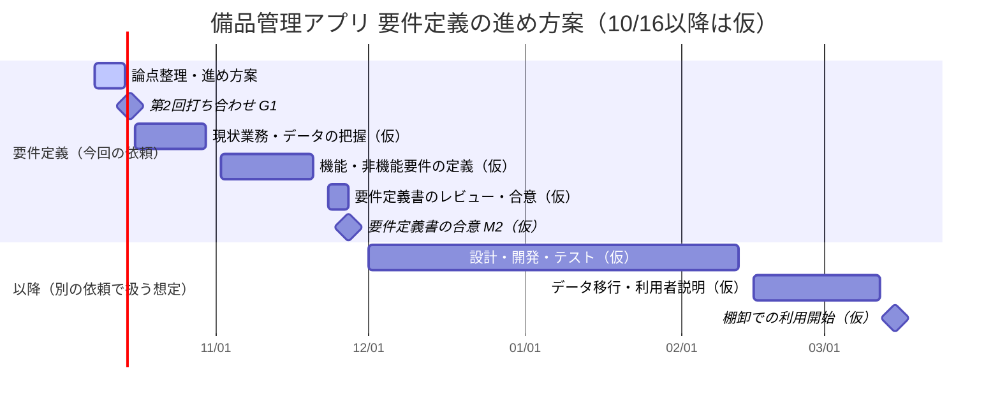

# 要件定義の進め方案（第2回打ち合わせ用）

> 【ダミー】Flow動作確認テスト用の架空案件。会社・人物・数値はすべて架空。

- 作成: 2026-10-08（W-0001 T-003）
- 根拠: 初回打ち合わせ議事録（MAT-0001）、RQ-0001 進行計画 改訂1
- **第2回打ち合わせ（2026-10-15）より後の日付はすべて当社の仮置きで、顧客とは合意していない。** 2027年3月の棚卸から逆算して置いた。工程の長さも当社の見込みで、範囲が決まった時点で引き直す。

## 1. 進め方の考え方

- 範囲を決める人と、何を先に作るかを最初に決める。決まる前に要件を細かく書き込むと、後で大きく書き直すことになるため。
- 2027年3月の棚卸に間に合わせるには、要件定義を11月中に終える必要がある（下の逆算）。そのため第一段階は「3月の棚卸で使う範囲」に絞り、それ以外は次の段階に回すことを提案する。
- 部署ごとに優先したいことが違うので、総務・経理・製造課・情シスの要望を並べて見えるようにしたうえで、判断者に決めてもらう。

## 2. スケジュール案

| 期間（10/16以降は仮） | 工程 | 主な内容 | 顧客にお願いしたいこと |
| --- | --- | --- | --- |
| 〜10/15 | 論点整理 | 初回の整理、確認項目一覧、この進め方案 | 第2回で判断者・第一段階・対象範囲・期限を決める |
| 10/16〜10/30 | 現状業務・データの把握 | 部署別の聞き取り（総務・経理・製造課・情シス）、現行Excel台帳と貸出簿の分析 | 台帳サンプルと貸出簿様式の提供、聞き取りの日程調整 |
| 11/2〜11/20 | 機能・非機能要件の定義 | 第一段階の機能、認証・端末・オフライン・外部連携の条件 | 要件の確認会への参加（週1回程度を想定） |
| 11/23〜11/27 | 要件定義書のレビュー・合意 | 要件定義書の確認と合意 | 判断者によるレビューと合意 |

逆算の前提（当社の見込み）: 棚卸の開始を3月中旬とし、その前の約4週間をデータ移行と利用者への説明、さらにその前の約10週間（年末年始を含む）を設計・開発・テストに充てる。範囲が大きくなれば、この期間では収まらない。

## 3. 第一段階の範囲の選択肢

第2回で判断者に選んでもらいたい。どれを選んでも、備品台帳とスマートフォンでのQR読み取りは共通で必要になる（全員一致の要望）。

| 案 | 第一段階（3月の棚卸まで）に入れるもの | 次の段階に回すもの | 良い点 | 気になる点 |
| --- | --- | --- | --- | --- |
| A 貸出管理を先に（総務の優先） | 台帳、QRでの貸出・返却 | 棚卸、固定資産台帳との連携 | 所在不明をすぐ減らせる | 3月の棚卸は従来どおりになり、棚卸の負荷は減らない |
| B 棚卸を先に（経理の優先） | 台帳、QRでの棚卸、固定資産台帳との連携 | 貸出管理 | 3月の棚卸の負荷と差異の説明を改善できる | 連携の仕様次第で期間が延びる。貸出の所在不明は残る |
| C 両方の最小限 | 台帳、QRでの貸出・返却・棚卸 | 固定資産台帳との連携、校正期限管理、購入申請 | 両部署の困りごとに3月までに手が届く | AやBより第一段階が大きく、日程の余裕が少ない |

当社としてはCを提案する。3月の棚卸で使うという希望と、所在を把握したいという希望の両方に応えられ、固定資産連携のように仕様が未確認で期間が読めないものを次の段階に分けられるため。ただし、決めるのは判断者であり、No.4（工具・測定器）やNo.5（業務PC）の結論で範囲はさらに変わる。

## 4. 第2回打ち合わせで決めたいこと

1. 最終判断者（確認項目一覧 No.1）
2. 第一段階の範囲（上の案A〜C、確認項目一覧 No.2・No.3）
3. 対象物品の範囲（確認項目一覧 No.4・No.5）
4. 要件定義の期限（このスケジュール案をたたき台に）
5. 台帳サンプル・貸出簿様式の受け渡し日（確認項目一覧 No.15）

## 5. 進め方の前提・お願い

- 製造課の担当者に、第2回への同席をお願いしたい（初回で高橋部長が調整すると発言）。
- 要件定義の期間中は、週1回程度の確認会を想定している。頻度と参加者は第2回で相談したい。
- 要件定義支援の契約・見積りは、当社 山田から別途相談する。
