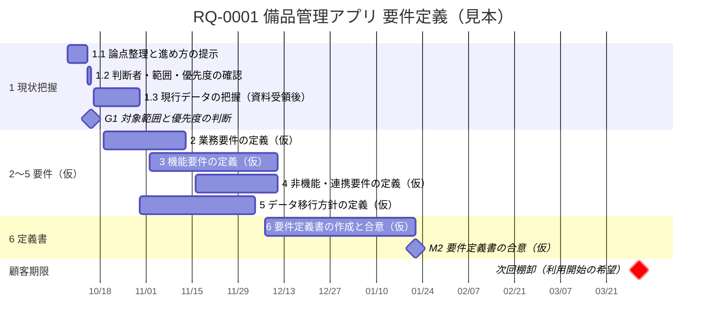

# RQ-0001 WBS（見本）

> 【提案用の見本】IMP-010の検討材料として作成した。Flowの正本ではなく、現行のSkill・テンプレート・検査には合わせていない。案件はダミー（ミナト精工 備品管理アプリ）。

## このファイルの役割

依頼の終了までに必要な作業を、長い時間軸で見渡すための地図。1つの作業パッケージは、複数のWorkを束ねる単位とする。Workを積み上げていくだけでは「全体のどこまで来たか」「何が残っているか」が見えなくなるため、その上位にこのガントチャートを置く。

- 粒度: 作業パッケージ（数週間〜1か月程度で、成果物が1つ決まる単位）。Workの細かさまでは割らない。
- 更新するとき: 作業パッケージの追加・削除、時期の見直し、Workの紐づけ、状態の変化。日々の進捗では更新しない。
- 書かないこと: 直近の順番・日程の細部（進行計画に書く）、TODO・実績（Workの作業メモに書く）。

## 到達点

顧客の判断者と要件定義書の内容に合意していること（RQ-0001の終了条件）。顧客は2027年3月末の棚卸での利用開始を希望している（CTX-0007）。

## ガントチャート

- 「（仮）」の行は、G1（2026-10-15）で範囲と期限が決まるまでの**AIによる仮置き**。2027年3月末の棚卸から逆算し、設計・開発の期間を残せるよう要件定義書の合意を1月下旬に置いた。顧客とは合意していない。
- 1.1・1.2は顧客との打ち合わせ日（議事録の宿題と次回予定）に基づく。1.3は資料の受領日が未定のため、受領を10月後半と仮定している。
- G1の結果でこの図を引き直す。仮置きの行は、根拠のある日付に置き換わった時点で「（仮）」を外す。

## 作業パッケージ

日付は上のガントチャートだけに書き、この表には持たせない（二重管理を避けるため）。

| WBS ID | 作業パッケージ | 成果物 | 完了条件 | 状態 | 紐づくWork |
| --- | --- | --- | --- | --- | --- |
| 1 | 現状把握と論点整理 | 1.1〜1.3の成果物 | 判断者・対象範囲・優先度・期限が決まっている（G1） | 未着手 | なし |
| 1.1 | 論点整理と進め方の提示 | 進め方案、確認項目一覧 | 顧客に提示した | 未着手 | なし |
| 1.2 | 判断者・範囲・優先度の確認 | 第2回打ち合わせ議事録 | 回答または未決理由が記録されている | 未着手 | なし |
| 1.3 | 現行データの把握 | 現状データ分析メモ | 移行項目とデータの問題点が整理されている | 未着手 | なし |
| 2 | 業務要件の定義 | 業務フロー（現行・新）、業務ルール一覧 | 対象業務ごとに新しい流れを顧客が確認した | 未着手 | なし |
| 3 | 機能要件の定義 | 機能一覧、画面・帳票の概要 | 第一段階で作る機能の範囲を顧客が確認した | 未着手 | なし |
| 4 | 非機能・連携要件の定義 | 非機能要件、外部連携の方針（固定資産、SSO、端末、オフライン） | 未確認事項（CTX-0010）に回答がそろっている | 未着手 | なし |
| 5 | データ移行方針の定義 | 移行方針（対象、クレンジングの分担） | 移行の範囲と分担を顧客と合意した | 未着手 | なし |
| 6 | 要件定義書の作成と合意 | 要件定義書 | 顧客の判断者と合意した（M2） | 未着手 | なし |

- WBS IDは階層を表す番号（1、1.1…）。並べ替えや追加で振り直さない。ガントチャートの行名の先頭にも同じ番号を付ける。
- 「紐づくWork」には、そのパッケージで開始したWorkのIDを追記していく（例: `W-0001, W-0003`）。1つのWorkは1つのパッケージにだけ紐づける。
- 親の状態は子とWorkの完了結果で判断する。

## 判断ゲート

| ゲート | 時期 | 決めること | 判断者 |
| --- | --- | --- | --- |
| G1 対象範囲と優先度 | 2026-10-15 | 判断者、対象物品の範囲、第一段階の優先度、要件定義の期限 | 顧客（高橋部長の見込み） |
| M2 要件定義書の合意 | 2027-01-22（仮） | 要件定義書の内容 | 未定（CTX-0011） |

## 改訂履歴

| 改訂 | 日付 | 変更内容 | 承認者 |
| --- | --- | --- | --- |
| 1 | 2026-10-08 | 見本として作成 | 未承認（提案用） |
| 2 | 2026-10-08 | ガントチャート形式に変更。日付はチャートだけに持たせ、表から時期の列を外した | 未承認（提案用） |
